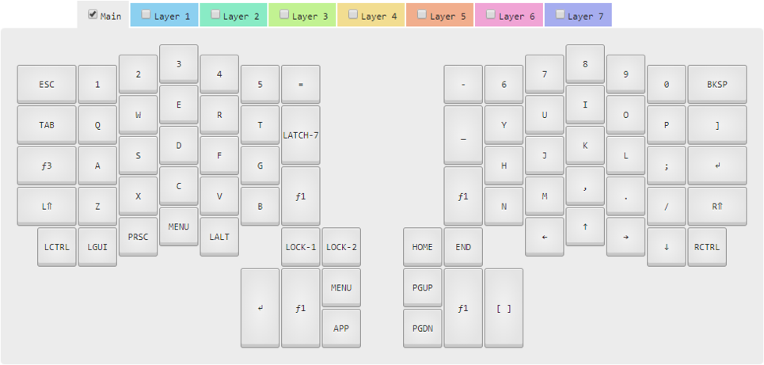
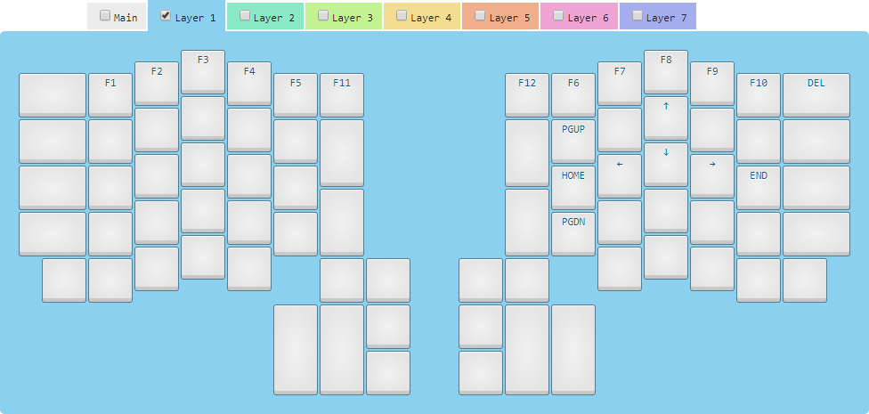
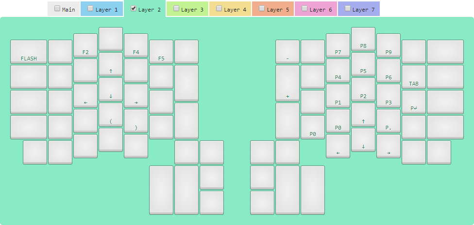
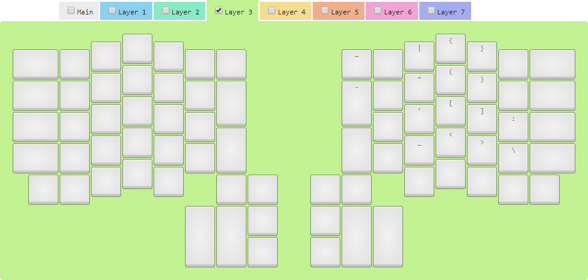
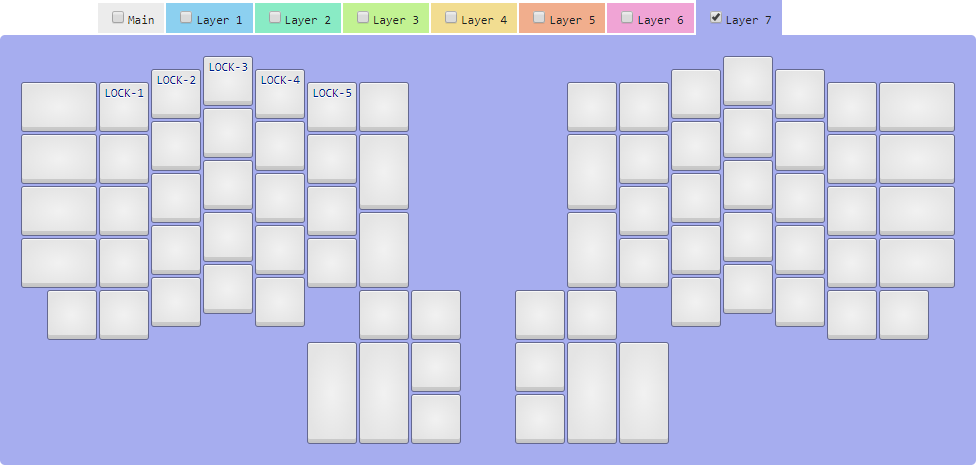

# cktc-ergodox
## An Ergodox laylout tailored for Pandas / Jupyter / Python Coding
### Overview
I wanted to tailor an Ergodox layout for working Python in general and Pandas / Jupyter specifically. This means prioritizing:
1. Keys that are used in Pandas, such as those that are used to address series and lists (i.e., square brackets and single-quotes). 
2. The underscore key, which is the preferred separator for use with Python names.

This is done using the right-hand home keys and the Layer3 modifier which is easily accessed via the key where the Caps Lock normally is.

It was also important to me to reduce the time it would take to get used to the layout, and limit its initial hit to my productivity. Hence, this layout:
1. Keeps the Enter and Backspace keys in their traditional locations.
2. Where appropriate, keys on hidden layers are organised logically so their location is easier to remember. For example, square backets, parantheses, and curly brackets, and angled brackets are all stacked so that each set is always typed with the middle and ring fingers of the right hand. Similarly, the double-quote is stacked on top of the single-quote.

Finally, where possible I wanted to create additional arrangements that would increase productivity by:
1. Adding an Enter button for the left thumb. It's amazingly useful when navigating using the mouse and keyboard. (In particular, shift-enter or ctrl-enter when running cells in Jupyter.)
2. Adding a modifier (Layer 1) that would allow a WASD-style cursor arrangement on the right hand home keys to make traversing text and menus quicker.
3. Creating a numpad that takes advantage of the natural position of the 7, 8, and 9 keys. (Although I'm not sure I'll stick with this as I have found it difficult to get use to because the right hand home keys then become 1, 2, and 3 - rather than the 4, 5, 6 of a normal numpad.)

Drop me a line if you have any feedback / criticism!

### Ergodox Layers
#### Main Layer

#### Layer 1 (f1)

#### Layer 2 (f2)

#### Layer 3 (f3)

#### Layer 7 (f7)
